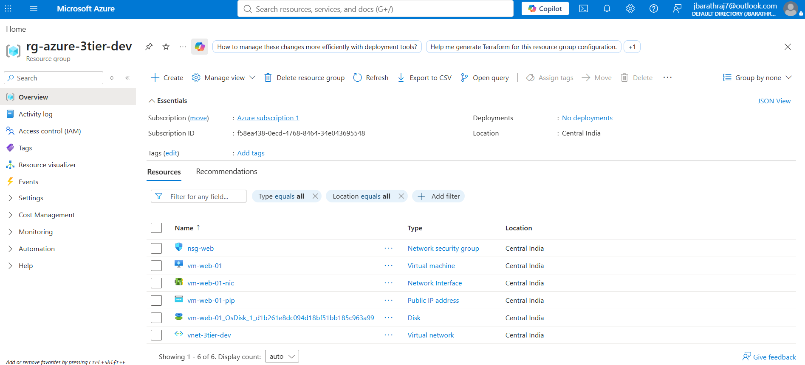
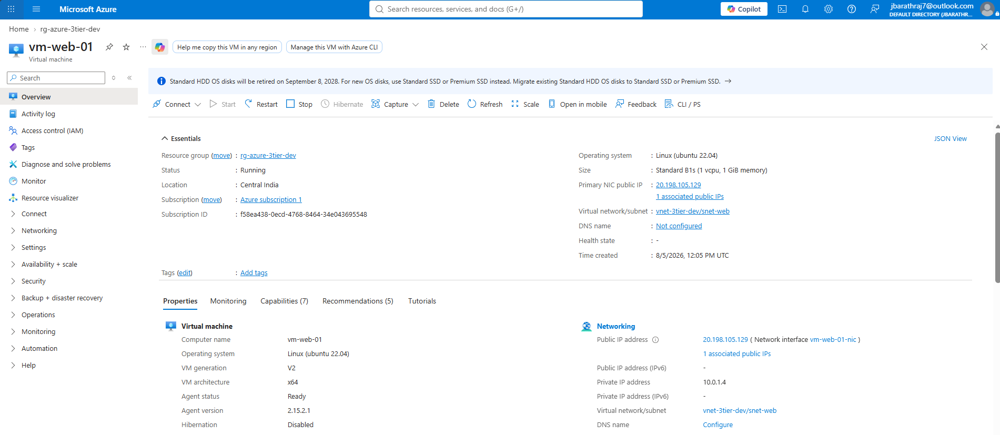
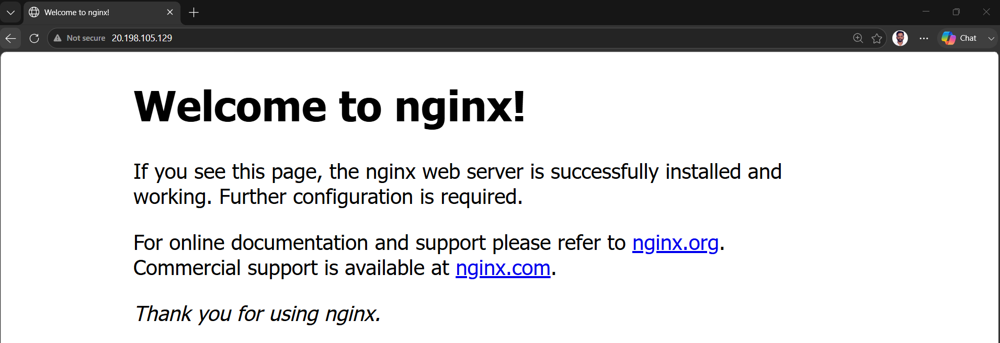
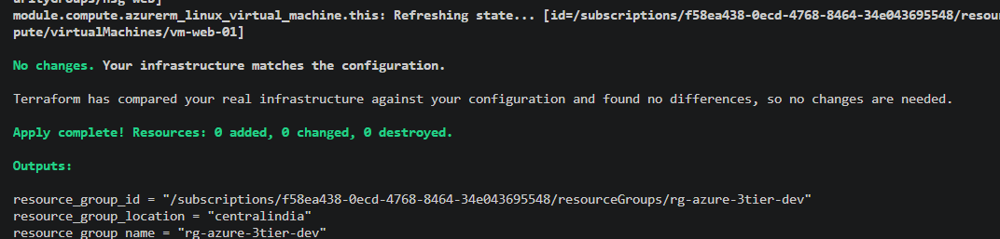

# 🚀 Azure 3-Tier Infrastructure using Terraform

> **Milestone 1:** Infrastructure Foundation

> A production-inspired Azure Infrastructure as Code (IaC) project built using Terraform, following modular design, Git workflows, and DevOps best practices.


---

# 📑 Table of Contents

- 📖 Project Overview
- 🎯 Objectives
- 📌 Current Status
- 🛠️ Technologies Used
- 🏗️ Architecture
- 📸 Deployment Screenshots
- 🚀 Project Roadmap
- 👨‍💻 About Me

---

# 📖 Project Overview

This project demonstrates how to provision a modular Azure infrastructure using **Terraform**.

The objective is to build a production-style Azure environment while following Infrastructure as Code (IaC), Git branching, and DevOps best practices.

This repository is being developed milestone by milestone to simulate a real-world cloud engineering project.

---

## ⭐ Project Highlights

- Production-inspired Azure Infrastructure as Code (IaC) project
- Modular Terraform architecture for reusable infrastructure
- Remote Terraform state stored securely in Azure Storage
- Automated infrastructure validation using GitHub Actions
- Secure Azure authentication using GitHub Service Principal and GitHub Secrets
- Feature branch development with Pull Request workflow
- Cloud-init automation for Nginx installation
- Designed as a portfolio project following DevOps best practices

---

# 🎯 Objectives

- Learn Infrastructure as Code using Terraform
- Build reusable Terraform modules
- Deploy Azure infrastructure from code
- Practice Git and GitHub workflows
- Implement DevOps best practices
- Build a professional cloud engineering portfolio

---

# 📌 Current Status

**Project Phase:** Milestone 5 Complete ✅

### ✅ Completed

- ✅ Resource Group
- ✅ Virtual Network
- ✅ Web Subnet
- ✅ Network Security Group
- ✅ Ubuntu Linux Virtual Machines
- ✅ Azure Load Balancer
- ✅ Nginx Installation using Cloud-Init
- ✅ Modular Terraform Architecture
- ✅ Remote Terraform State (Azure Storage)
- ✅ Git Feature Branch Workflow
- ✅ GitHub Pull Requests
- ✅ GitHub Actions CI Pipeline
- ✅ Terraform Format Validation
- ✅ Terraform Initialization
- ✅ Terraform Validation
- ✅ Secure Azure Authentication using GitHub Secrets

### 🚀 Next Milestone

- Docker
- Azure Container Registry (ACR)
- Azure Kubernetes Service (AKS)
- Helm
- Monitoring

---

# 🛠️ Technologies Used

| Technology | Version | Purpose |
|------------|---------|---------|
| Microsoft Azure | Azure Cloud | Cloud Platform |
| Terraform | v1.14.x | Infrastructure as Code |
| Azure CLI | v2.x | Azure Authentication |
| Git | Latest | Version Control |
| GitHub | Cloud | Source Code Management |
| Ubuntu Server | 22.04 LTS | Linux Operating System |
| Nginx | Latest | Web Server |
| Visual Studio Code | Latest | Development Environment |

---

# 🏗️ Architecture

The current infrastructure deployed in Azure is shown below:

```text
                        Internet
                            │
                            ▼
                   Azure Load Balancer
                            │
             ┌──────────────┴──────────────┐
             ▼                             ▼
        Ubuntu VM-01                  Ubuntu VM-02
             │                             │
             └──────────────┬──────────────┘
                            ▼
                     Virtual Network
                            │
                      Network Security Group
                            │
                     Resource Group
                            │
                  Terraform Infrastructure
                            │
                      GitHub Actions CI
                            │
                 Terraform fmt → init → validate
```

### Azure Resources

- Resource Group
- Virtual Network
- Web Subnet
- Network Security Group
- Public IP Address
- Ubuntu Linux Virtual Machine
- Nginx Web Server

> **Note:** This architecture represents Milestone 1. Future milestones will introduce a Load Balancer, Storage Account, Key Vault, Monitoring, and CI/CD pipeline.

---

# 📸 Deployment Screenshots

The following screenshots demonstrate the successful deployment and validation of the Azure infrastructure.

---

## 1️⃣ Azure Resource Group

The Resource Group contains all resources provisioned through Terraform for Milestone 1.



---

## 2️⃣ Ubuntu Linux Virtual Machine

Ubuntu Linux virtual machine successfully deployed with a Public IP and running in Azure.



---

## 3️⃣ Nginx Web Server

Nginx installed and verified by accessing the VM's public IP from a web browser.



---

## 4️⃣ Terraform Validation

Terraform confirms that the deployed Azure infrastructure matches the configuration with no changes required.



---

## CI/CD Pipeline

The project includes a GitHub Actions workflow to automatically validate Terraform code.

### Current pipeline

- ✅ Terraform format check (`terraform fmt -check`)
- ✅ Terraform initialization (`terraform init`)
- ✅ Terraform validation (`terraform validate`)

### Planned enhancements

- Terraform plan
- Deployment approval

### CI/CD Status

The GitHub Actions pipeline automatically runs on every push and pull request to the `main` branch.

**Pipeline stages:**

- ✅ Terraform Format Check
- ✅ Terraform Initialization
- ✅ Terraform Validation
- ✅ Azure Authentication using GitHub Secrets

This ensures Infrastructure as Code (IaC) changes are validated before being merged into the main branch.

---

# 💡 Skills Demonstrated

- Infrastructure as Code (Terraform)
- Azure Infrastructure Provisioning
- Terraform Modules
- Remote State Management
- Azure Virtual Networking
- Network Security Groups (NSG)
- Azure Load Balancer
- Linux Administration
- Cloud-Init Automation
- Git & GitHub Workflow
- Feature Branch Development
- Pull Requests & Code Reviews
- GitHub Actions CI/CD
- Azure Service Principal Authentication
- GitHub Secrets Management
- Infrastructure Validation using Terraform

---

# 👨‍💻 About Me

Hi, I'm **Barath Raj J**.

I'm an IT Infrastructure professional transitioning into **Cloud & DevOps Engineering**, with hands-on experience in Azure, Terraform, Git, GitHub Actions, Windows Server, and IT Operations.

This repository is part of my practical learning journey, where I build production-inspired projects to strengthen my Infrastructure as Code (IaC), cloud automation, and CI/CD skills.

### Connect with me

- **GitHub:** https://github.com/barry-217
- **LinkedIn:** *(We'll add your LinkedIn profile in the next phase.)*